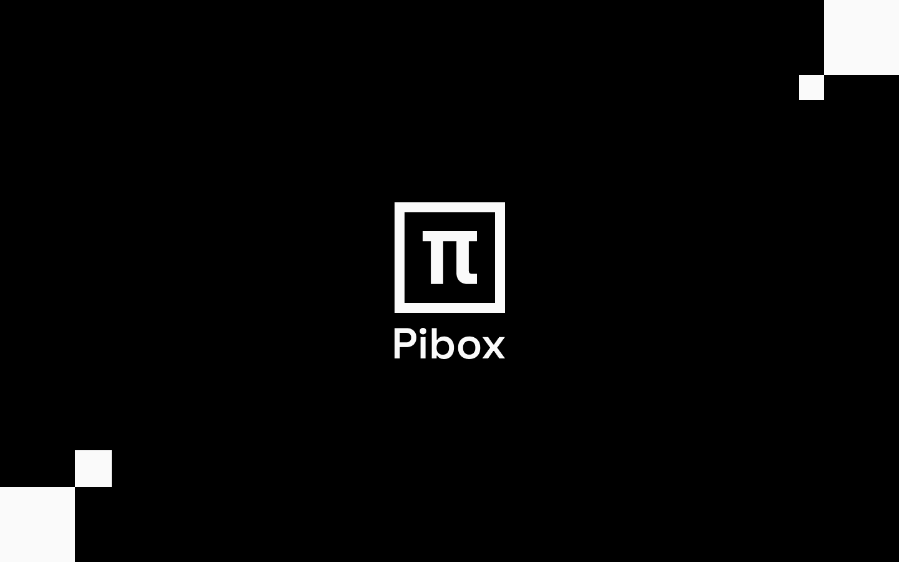

# PiBox

<figure><figcaption></figcaption></figure>


[](https://github.com/sia-digital/pibox/blob/main/LICENSE.txt)


PiBox is a `service hosting framework` that allows `.net devs` to `decorate their services with behaviours or functionality (think of plugins) while only using minimal configuration`.

> "PiBox" because we want to support unlimited plugins within the api out of the box!

## Features

* logs
* metrics
* traces
* minimal api ready
* auto discovered plugins
* with performance in mind
* less memory allocations
* industry best practices applied security
* standard dotnet core patterns & APIs
* many plugins!

## Prerequisites

Before you begin, ensure you have met the following requirements:

* You have installed the latest version of `.net8 sdk`


## Get started

To start using PiBox components/plugins, you have to:

1. Install/add the PluginWebHost via nuget package `PiBox.Hosting.WebHost`
2. Install/add the source generator plugin via nuget package `PiBox.Hosting.Generator`
3. Rewrite the Entrypoint `Program.cs` to have following code:

```c#
using PiBox.Hosting.WebHost;
PluginWebHostBuilder.RunDefault(PiBox.Generated.PiBoxPluginTypes.All);
```

4. Install/add your plugins via nuget packages prefixed with `PiBox`

## Documentation

You can find a comprehensive documentation [here](https://sia-digital.gitbook.io/pibox/)

Or check the individual README files in each plugins directory


## Building PiBox

To build PiBox, follow these steps:

```sh
dotnet build ./PiBox.sln
```

To format and style check the solution run:

```sh
dotnet format ./PiBox.sln
```

## Testing PiBox

We are using these frameworks for unit testing

* AutoBogus
* Bogus
* Microsoft.NET.Test.Sdk
* NaughtyStrings.Bogus
* NSubstitute
* NUnit
* RichardSzalay.MockHttp
* WireMock.Net

To run unit tests for PiBox, follow these steps:

```
dotnet test ./PiBox.sln
```

## Contributing to PiBox

To contribute to PiBox, follow these steps:

1. Check the issues if your idea or problem already exists
2. Open a new issue if necessary to explain your idea or problem with as much details as possible

To contribute code along your issue please follow the these steps:
2. Clone this repository.
3. Create a branch: `git checkout -b <branch_name>`.
4. Check our used tools and frameworks to ensure you are using the same tools which are already in place.
5. Check if your changes are in line with our style settings from .editorconfig and run `dotnet format`.
6. Make your changes and commit them: `git commit -m '<commit_message>'`
7. Push to the original branch: `git push origin PiBox/<branch_name>`
8. Create the pull request.

## Development decisions

* Follow the code style which is configured via `.editorconfig`

### Disabled Compiler Errors

| Code | Reason                                      | Link                                                                                               |
| ---- | ------------------------------------------- | -------------------------------------------------------------------------------------------------- |
| 1701 | Assembly Referencing                        | [1701](https://docs.microsoft.com/en-us/dotnet/csharp/language-reference/compiler-messages/cs1701) |
| 1702 | Assembly Referencing                        | [1702](https://docs.microsoft.com/en-us/dotnet/csharp/misc/cs1702)                                 |
| 1591 | Disable XML Comments                        | [1591](https://docs.microsoft.com/en-us/dotnet/csharp/language-reference/compiler-messages/cs1591) |
